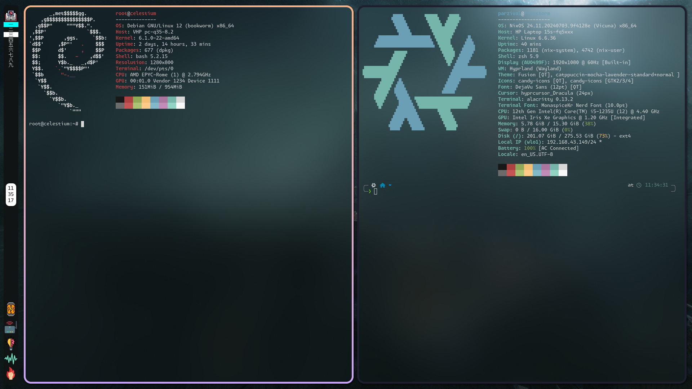

# flake_firestorm

The NixOS config of my laptop optimised for productivity and student/dev life making use of a custom rebuild binary/script which rebuilds the entire configuration, gives concise error messages unlike the default errors and generates a log file.
  
## Showcase

